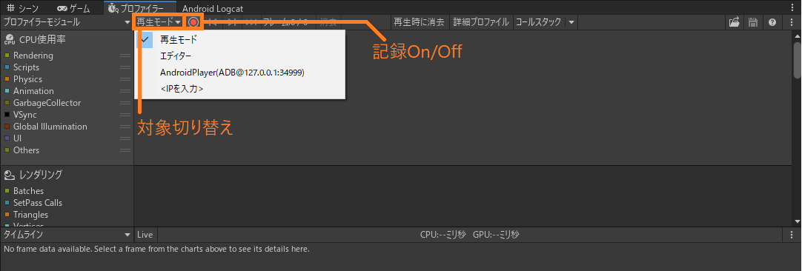
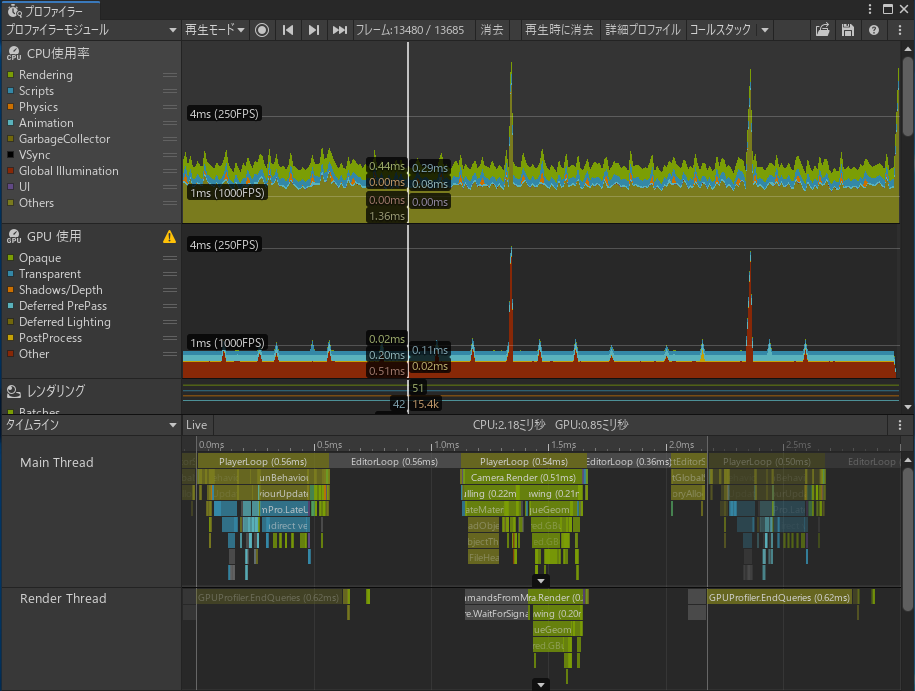

# モデルとパフォーマンスの関係 in Unity

yusuke-ota

---

## △自己紹介

yusuke-ota

職種: 一般事務
言語: Rust, C#, Ruby, C++
最近の関心事: パフォーマンス, 低レイヤ, 仮想コンテナ

最近Quest用アプリケーション最適化やってます(GPUがつらい)

---

## 今回のお話し

Unityの最適化のグラフィック側の話を簡単にします。

本とかサイトを見ればわかるけど、その前の一歩になるかな？

---

### 対象

* Unityで最適化とかあんまりやったことがない人
* モデルがゲームのパフォーマンスにどのように影響するのか知りたい人

### 対象じゃない人

* コーディングで高速化したい人
* シェーダー書いている人

---

## 目次

1. Profiling
1. モデルのパフォーマンスに対する影響
1. まとめ
1. 次に読む
1. 参考文献

---

## 1. Profiling

Unityのプロファイラの使い方、見方を話します。

* プロファイラ起動
* プロファイリング開始
* プロファイラの見方
* グラフィックの処理に時間がかかっている様子

---

### 1-1. プロファイラ起動

---

### 1-2. プロファイリング開始

---

### 1-3. GPUプロファイリング設定

---

### 1-4. プロファイラの見方

---

### 1-5.グラフィックの処理に時間がかかっている様子

プロファイラ関係はこれがわかりやすい
[パフォーマンスの計測 再入門 〜Unity 2020版〜(5月28日号) - Unityステーション](https://www.youtube.com/watch?v=UZ2sLiAM0oE&list=PLFw9ryLdiLzZrglM9EATbH5kb46r736Et&index=41)

---

## 2. モデルのパフォーマンスに対する影響

レンダーの処理を追いながら、Blenderに関係のある部分を細かく見ていきます。

* 描画時の処理
* 実際の処理を見てみる
* カリング
* バッチング
* シェーダー

---

### 2-1. 描画時の処理

---

### 2-2. 実際の処理を見てみる

#### 2-2-1. FrameDebugger

あるフレームの中でバッチごとの画面描写を見ることができる機能。

バッチングされない理由も記載されるので、バッチングのデバックに便利。

---

#### 2-2-2. 処理

todo: 画像
<!-- FrameDebuggerでどの処理が何にあたるのか軽く解説 -->

---

### 2-3. △描画時の処理 In VR

VRだと画面が2つなので、処理がちょっと変わる

このページが分かりやすい
[凹みTips Unity の XR 向けシングルパスステレオレンダリングについて調べてみた](http://tips.hecomi.com/entry/2018/11/04/232219)

---

#### 2-3-1. △マルチパスレンダリング

普通にレンダリングすると、左目画面、右目画面を別々に処理する
≒2回分処理しているので2倍時間がかかる

---

#### 2-3-2. △シングルパスステレオレンダリング

両目の画面を合わせて、1画面としてレンダリングする機能
ただし、**シェーダーが対応している必要** がある

---

### 2-4. カリング

---

#### 2-4-1. フラスタムカリング

カメラに移っていない部分の描画を省く機能
Unityでは標準で働く

フラスタム=錐台(四角錐の上半分を切り落とした形状)
カメラの視認範囲がそういう形をしている

todo: 余裕があったら図作成

---

#### 2-4-2. オクルージョンカリング1

物体が被って完全に見えない部分の描画を省く機能
**設定が必要**

オーバードローが多いほど効果がある(ex: 建物の中)
動作にCPUコストがかかるので、オーバードローが少ない時は切った方が良い

詳しい手順はこの辺がわかりやすい
<https://light11.hatenadiary.com/entry/2019/11/11/220337>

---

#### 2-4-3. オクルージョンカリング2

todo: いい感じのカリング前後のOverDraw写真追加

---

### 2-5. バッチング

---

#### 2-5-1. 静的バッチング

動かない(静的な)ものが対象
あらかじめメッシュを結合(アトラス化)してキャッシュする
キャッシュする分メモリを消費する

#### 2-5-2. 動的バッチング

頂点数が少ない、同一マテリアルのものが対象
詳しい仕組みよくわかんない
計算する分CPUリソースを消費する

<https://docs.unity3d.com/ja/2019.4/Manual/DrawCallBatching.html>

---

#### 2-5-3. GPUインスタンシング

メッシュとマテリアルを共有するもの(Prefabとか)が対象
使いまわして処理量を減らす

<https://docs.unity3d.com/ja/2019.4/Manual/GPUInstancing.html>

---

#### 2-5-4. バッチングされない原因

主な原因は**Set Pass Call**
(使用するデータが変わる時、CPUからGPUにデータを送る処理)

Build-inでの具体的な主なタイミングは、

* 使うマテリアルが替わる時
* 使うシェーダーが替わる時
* 使うテクスチャが替わる時
* 使うライトマップが替わる時(ライトベイク時)

英語、ちょっと古いが、条件が詳しく書いてある。
[How to see why your draw calls are not batched in 5.6](https://blogs.unity3d.com/2017/04/03/how-to-see-why-your-draw-calls-are-not-batched-in-5-6/)

注: SRPは使うシェーダーが替わる時のみ
<https://blogs.unity3d.com/jp/2019/02/28/srp-batcher-speed-up-your-rendering/>

---

#### 2-5-5. FrameDebuggerでバッチングされない原因を見てみる

---

#### 2-5-6. アトラス化

複数のテクスチャをまとめて一つのテクスチャにすること

* 同じ設定のマテリアルを使っている
* でもテクスチャが違うから完全に同じマテリアルにできない

といったときに使うと良い(最適化の最終段階で)

---

#### 2-5-7. マテリアル結合

[Mesh Baker](https://assetstore.unity.com/packages/tools/modeling/mesh-baker-5017)、[Mesh Baker Free](https://assetstore.unity.com/packages/tools/modeling/mesh-baker-free-31895?locale=ja-JP)
を使おう

---

### 2-6. シェーダー

#### 2-6-1. 頂点シェーダー

頂点に作用する(≒形状に作用する)シェーダー
頂点数が多いほど(≒ハイポリなほど)処理に時間がかかる
画面内ではどんなに小さくても関係ない

大体は、座標変換くらいしかしない(そんなに重くない)

---

##### 2-6-1-1. LOD

距離に応じて、モデルを切り替える機能
モデルは個別に準備が必要

todo: 図

このページが分かりやすいと思う。
[【Unity】LODで負荷を軽減させて60FPSを死守する - おもちゃラボ](https://nn-hokuson.hatenablog.com/entry/2017/03/21/200013)

---

#### 2-6-2. ジオメトリシェーダー

ポリゴンに作用するシェーダー
パーティクル以外のかっこいいエフェクトとかは大体これ

全然使ったことないので何も分からない

---

#### 2-6-3. フラグメントシェーダー

画面に対して作用するシェーダー
画面の画素数 × 画面に占める割合 に比例して処理に時間がかかる
画面内で小さいほど処理に時間がかからない

色を塗ったりする

---

### 2-7. RenderDoc

レンダリングのどの処理がどのくらい時間がかかっているのかわかるすごいやつ
ProfilerのGPUプロファイリングをオンにすると、ある程度は同じことができる

---

## 3.まとめ

グラフィックのパフォーマンスで関係あるのは主に頂点数、テクスチャ、シェーダー

* テクスチャをたくさん使うとバッチがまとめられずドローコールが増える
* テクスチャが重いと、GPUへの読み込みが遅くなる(特にスタンドアローン機)
* 頂点数が多いと頂点シェーダーが重くなる
* 計算量が多い(重い)シェーダーを使うとGPUでの処理が重くなる

だから

* LODを使う
* アトラス化する
* シェーダーを軽量化する(高難易度)

---

## 4.次に読む/見る

* [パフォーマンスの計測 再入門 〜Unity 2020版〜(5月28日号) - Unityステーション](https://www.youtube.com/watch?v=UZ2sLiAM0oE&list=PLFw9ryLdiLzZrglM9EATbH5kb46r736Et&index=41)
  * Profilerの使い方を大体理解できる
* [メインループ マニアック解説〜これからのTime.deltaTime〜 - Unityステーション](https://www.youtube.com/watch?v=TP7N57r5Tqw&list=PLFw9ryLdiLzZrglM9EATbH5kb46r736Et&index=2)
  * UnityでCPU,GPUがどういう順序で動作するのかざっくり理解できる
* [Unity Learning Materials シェーダを理解しよう](https://learning.unity3d.jp/2042/)
  * シェーダーでどんな処理を行っているのかざっくり理解できる
* [Unity 2017最適化ガイド](https://www.amazon.co.jp/Unity-2017%E6%9C%80%E9%81%A9%E5%8C%96%E3%82%AC%E3%82%A4%E3%83%89-Unity%E3%81%AE%E3%81%82%E3%82%89%E3%82%86%E3%82%8B%E3%83%91%E3%83%95%E3%82%A9%E3%83%BC%E3%83%9E%E3%83%B3%E3%82%B9%E5%95%8F%E9%A1%8C%E3%82%92%E8%A7%A3%E6%B1%BA%E3%81%99%E3%82%8B%E3%81%9F%E3%82%81%E3%81%AE%E6%89%8B%E5%BC%95%E3%81%8D-Chris-Dickinson-ebook/dp/B088K1Y4Y5)
  * コード、物理、UI、描画と広範囲の最適化方法がわかる1冊
* [Unity ユーザーマニュアル](https://docs.unity3d.com/ja/2019.4/Manual/UnityManual.html)
  * 分からないところを辞書的に調べるのは良いと思う。全部読むには分量が...

---

## 参考文献

* "Chris Dickinson 著, 佐藤 敬 訳", "Unity 2017最適化ガイド: Unityのあらゆるパフォーマンス問題を解決するための手引き", 株式会社達人出版会, 2020-5
* Unity ユーザーマニュアル <https://docs.unity3d.com/ja/2019.4/Manual/UnityManual.html>
